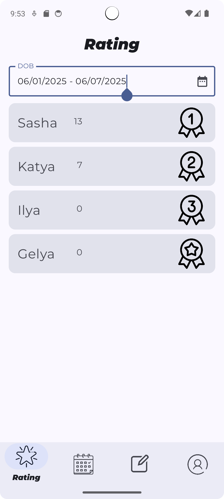

# 👨‍👩‍👧‍👦 Together App

Приложение для совместного ведения домашних дел внутри семьи. Пользователи могут создавать список задач, назначать количество баллов за их выполнение и соревноваться за первое место в семейном рейтинге.

## 🎥 Демо-видео

Посмотреть демонстрацию приложения:

▶️ [Смотреть демо (WEBM)](screenshots/App_work.webm)

## 🛠️ Технологии

- **Jetpack Compose**
- **Firebase Auth** — регистрация и авторизация по email
- **Firebase Firestore** — облачное хранилище данных (заменил Room)
- **Jetpack Navigation (NavController)** — навигация между экранами
- **Kotlin Coroutines/Flow**

## 📲 Возможности

- Регистрация и вход через Firebase (email + пароль)
- Создание семьи / Присоединение к семье по имени и паролю
- Добавление, изменение и удаление дел в рамках семьи
- Назначение баллов за выполнение дел
- Подсчёт и отображение рейтинга участников семьи
- Добавление сроков выполнения задач
- Сортировка рейтинга по неделям
- Возможность смены семьи и выхода из текущей
- Редактирование профиля пользователя

## 🧱 Архитектура проекта

Проект построен на основе архитектурного паттерна **MVVM (Model-View-ViewModel)** с чётким разделением слоёв:

### 📂 Основные уровни:

- **UI (View Layer)** — `ui/`  
  Содержит все Composable-экраны, сгруппированные по функциональности: вход, задачи, семья, рейтинг и т.д. Каждый экран имеет свой `ViewModel`. Общие элементы, такие как `TogetherTopBar` и темы, вынесены отдельно.

- **ViewModel Layer** — `*ViewModel.kt`  
  ViewModel-ы управляют состоянием и бизнес-логикой экранов, взаимодействуют с репозиториями и предоставляют UI-данные в виде `UiState`.

- **Repository Layer** — `repository/`
  Репозитории инкапсулируют доступ к данным и объединяют разные источники (например, Firebase).  
  _Примеры:_ `AuthRepository`, `FamilyRepository`, `UserRepository`.

- **Data Source Layer** — `datasource/`  
  Классы, напрямую работающие с Firebase (Firestore, Auth), например `AuthRemoteDataSource`, `UserRemoteDataSource`.

- **Model Layer** — `model/`  
  Простые `data class` модели: `User`, `Family`, `Housework` и др. Используются для хранения и передачи данных между слоями.

- **Навигация** — `navigation/`  
  Используется `NavController` с навигационной схемой в `TogetherNavGraph`. Экраны оформлены как `NavigationDestination`, что облегчает добавление новых разделов.

- **Локальная база данных (устаревшая)** — `TogetherDatabase`, `TogetherDao`  
  Ранее использовалась Room. Сейчас основное хранилище — Firestore, но структура базы осталась (в дальнейшем планируется удалить или преобразовать для офлайн-режима).

- **Инициализация и DI** — `AppContainer.kt`, `TogetherApplication.kt`  
  Простая реализация Dependency Injection вручную. В дальнейшем можно заменить на Hilt.

## 📌 Планы на развитие

- 🎨 Улучшение UI/UX
- 👨‍👩‍👧‍👧 Добавление редактора семьи
- 🔁 Dagger/Hilt
